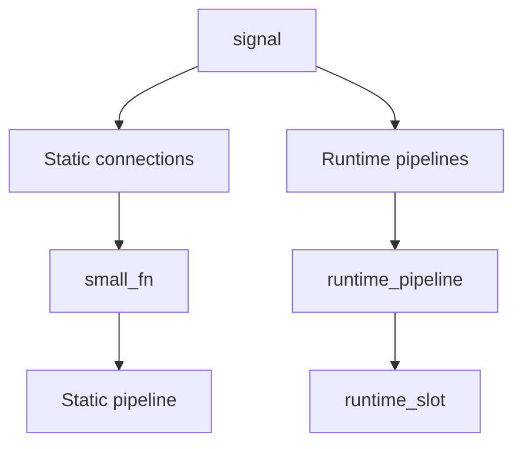
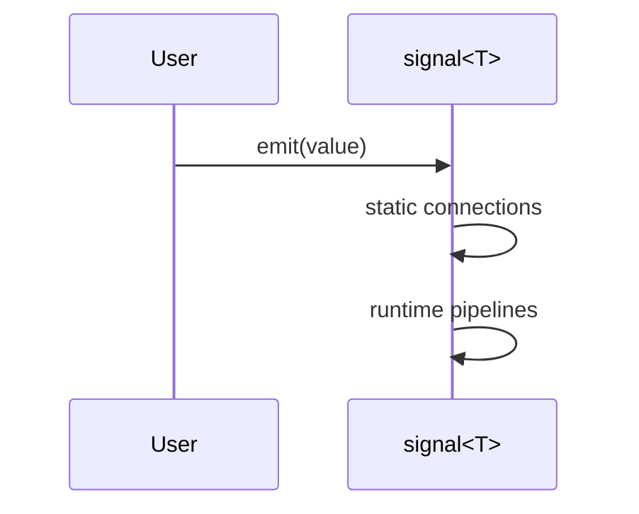

# slotchain

**slotchain** is a modern, header-only **C++20 signal–slot library** that unifies:

- **compile-time static pipelines** (zero-cost abstractions),
- **runtime dynamically composed pipelines**, and
- **hybrid pipelines** (static subgraphs embedded in runtime chains),

with **explicit lifetime management** and **predictable execution semantics**.

It is designed as a clean, transparent alternative to traditional signal–slot frameworks,
without macros, code generation, or hidden runtime behavior.

---

## ✨ Key Features

- ✅ Header-only, C++20
- ✅ Zero-cost static pipelines
- ✅ Runtime dynamic pipelines
- ✅ Hybrid static-in-runtime pipelines
- ✅ Explicit disconnect tokens
- ✅ RAII-based auto-disconnect
- ✅ Predictable execution order
- ✅ No macros, no code generation
- ✅ No hidden thread safety

---

## 🧠 Design Philosophy

1. Zero-cost where possible  
2. Explicit trade-offs  
3. No magic  
4. Clear separation of concerns  
5. Composable abstractions  

---

## 🧩 Architecture Overview



---

## 🚀 Getting Started

### Static pipeline

```cpp
signal<int> sig;

auto pipeline =
    slot<int>([](int x){ return x * 2; }) |
    slot<int>([](int x){ std::cout << x << "\n"; return; });

sig.connect(pipeline);
sig.emit(21);
```

### Runtime pipeline

```cpp
auto& rp = sig.connect_runtime();
rp.add_slot<int,int>([](int x){ return x + 1; });
rp.add_slot<int,void>([](int x){ std::cout << x << "\n"; });
```

### Hybrid pipeline

```cpp
auto fast =
    slot<int>([](int x){ return x * 3; }) |
    slot<int>([](int x){ return x - 1; });

rp.add_static<int,int>(fast);
```

---

## 🔌 Lifetime Management

```cpp
scoped_connection c = sig.connect_scoped(pipeline);
```

Disconnect is O(1), idempotent, and explicit.

---

## ⏱ Execution Order



---

## 🧵 Threading Model

slotchain is **not thread-safe by default**.
Thread-safe variants are opt-in future work.

---

## 📚 Documentation

- docs/DESIGN.md
- docs/CURRENT_STATE.md
- docs/ROADMAP.md
- AGENTS.md
- CONTRIBUTING.md

---

## 🔐 Versioning

- Current version: v0.1.0
- API: frozen

---

## 📜 License

MIT License.
